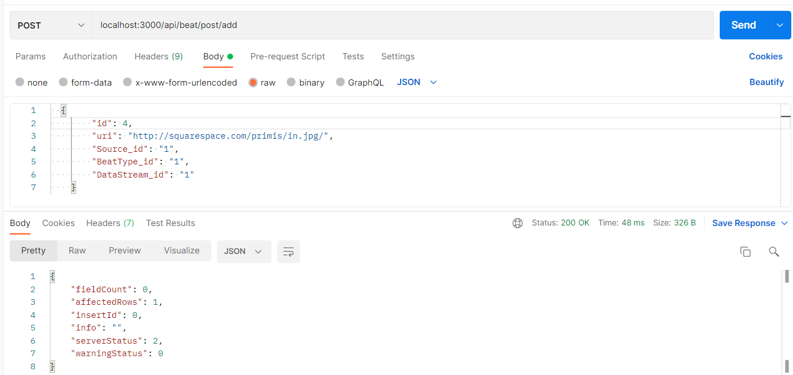
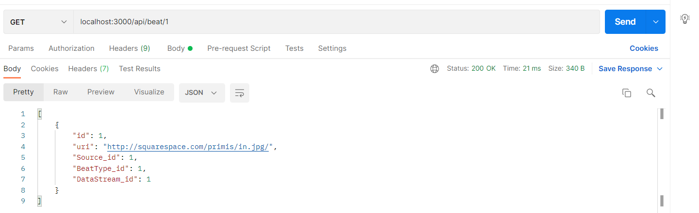
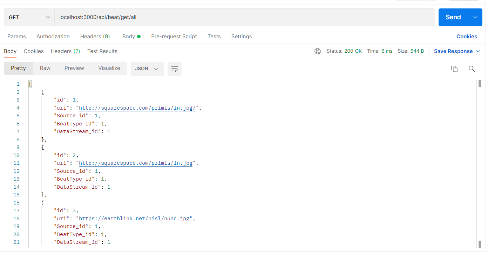
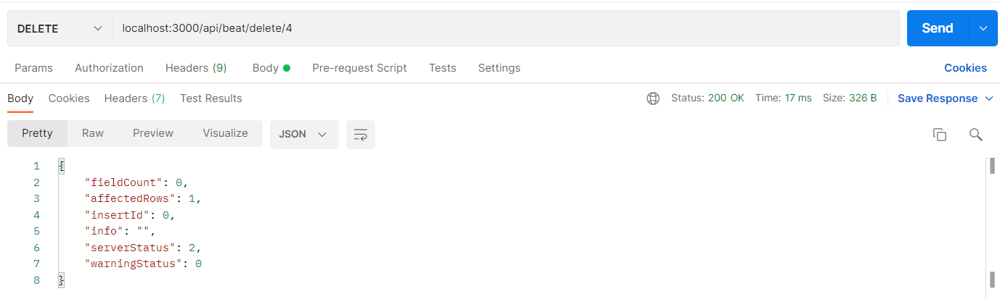

# Тестування працездатності системи

-'/api/beat/post/add' - Додати біт

-'/api/beat/:id' - Отримати біт за його id

-'/api/beat/get/all' - Отримати всі біти

-'/api/beat/put/update' - Оновити дані 

-'/api/beat/delete/:id' - Видалити біт за його id

